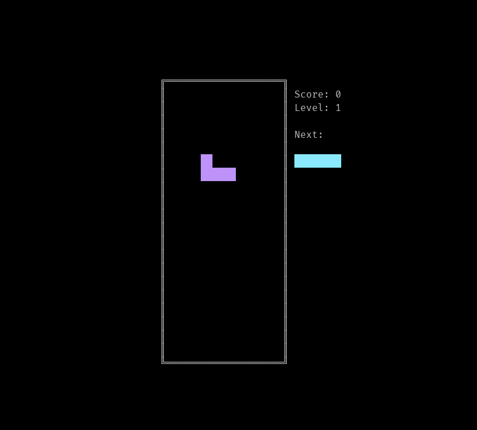
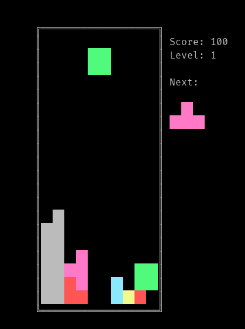
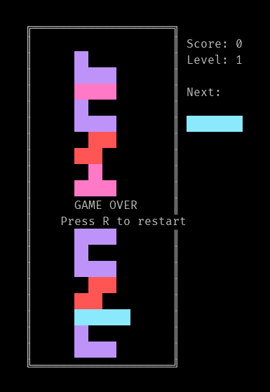

# Tetris em Go

## Descrição

Este é um jogo de Tetris feito em Go. O jogo foi feito com o intuito de aprender Go e também para praticar programação.

## Como jogar

Os comandos são simples:
- `←`: Move a peça para a esquerda
- `→`: Move a peça para a direita  
- `↓`: Move a peça para baixo
- `↑`: Rotaciona a peça
- `ESC`: Pausa ou Sai do jogo (Após Game Over)
- `r` ou `R`: Reinicia o jogo (Após Game Over)

## Como instalar

Para instalar o jogo, você precisa ter o Go instalado em sua máquina. Com o Go instalado, basta clonar o repositório, instalar as dependências e compilar o jogo.

```bash
git clone github.com/chmenegatti/tetris
cd tetris
go get -u github.com/gdamore/tcell/v2
go build -o tetris
```

## Como executar

Para executar o jogo, basta rodar o binário gerado.

```bash
./tetris
```
## Screenshots





## Licença

Este projeto é licenciado sob a licença MIT - veja o arquivo [LICENSE](LICENSE) para mais detalhes.
```